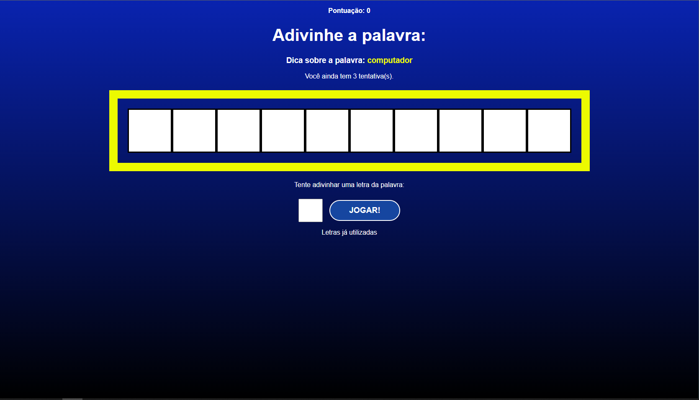

# Secret Word

## Descrição do Projeto

O projeto "Secret Word" é um jogo inspirado no clássico jogo da forca. O objetivo é adivinhar a palavra secreta com apenas 3 tentativas. Se você errar, é game over!

## Como Jogar

1. Inicie o jogo.
2. Você terá 3 chances para adivinhar a palavra secreta.
3. Se você adivinhar a palavra corretamente, você ganha!
4. Se você esgotar todas as suas tentativas sem adivinhar a palavra, o jogo termina.

## Pontuação

A pontuação é baseada no número de tentativas restantes após adivinhar a palavra corretamente. Quanto menos tentativas você usar, maior será sua pontuação!

## Game Over

Se você esgotar todas as suas tentativas e não conseguir adivinhar a palavra, é game over. Mas não se preocupe, você pode sempre tentar novamente!

